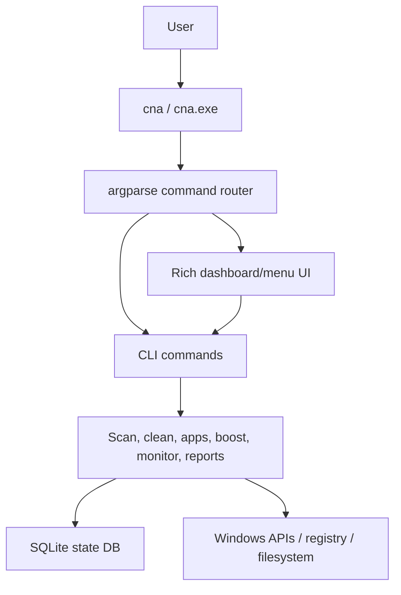
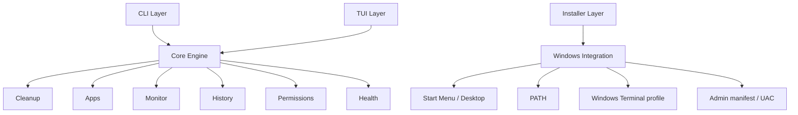
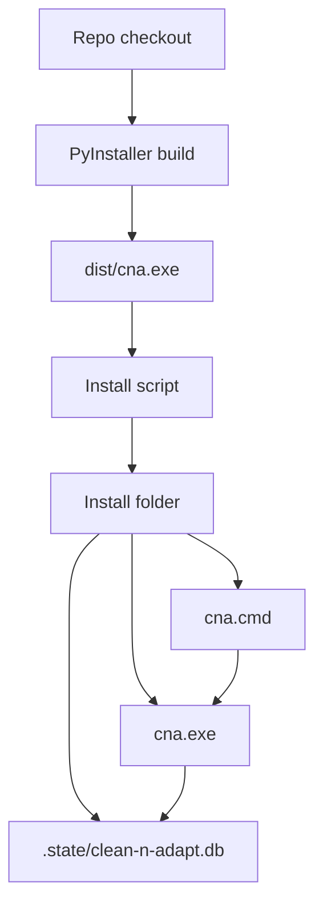
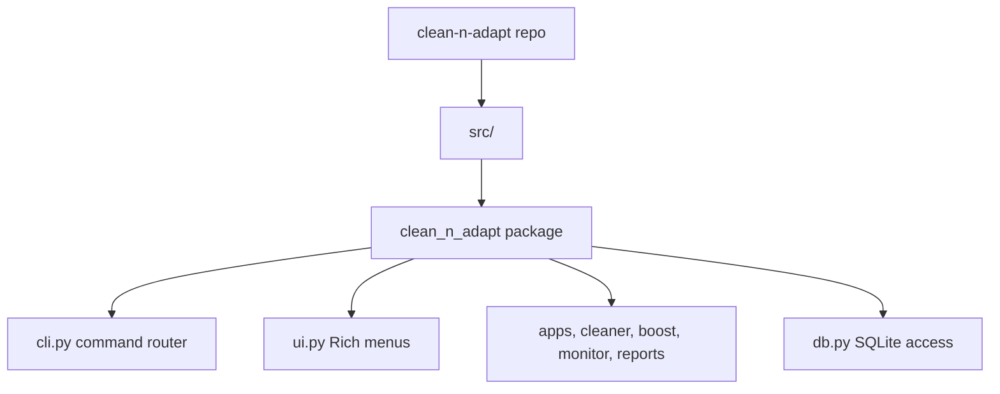
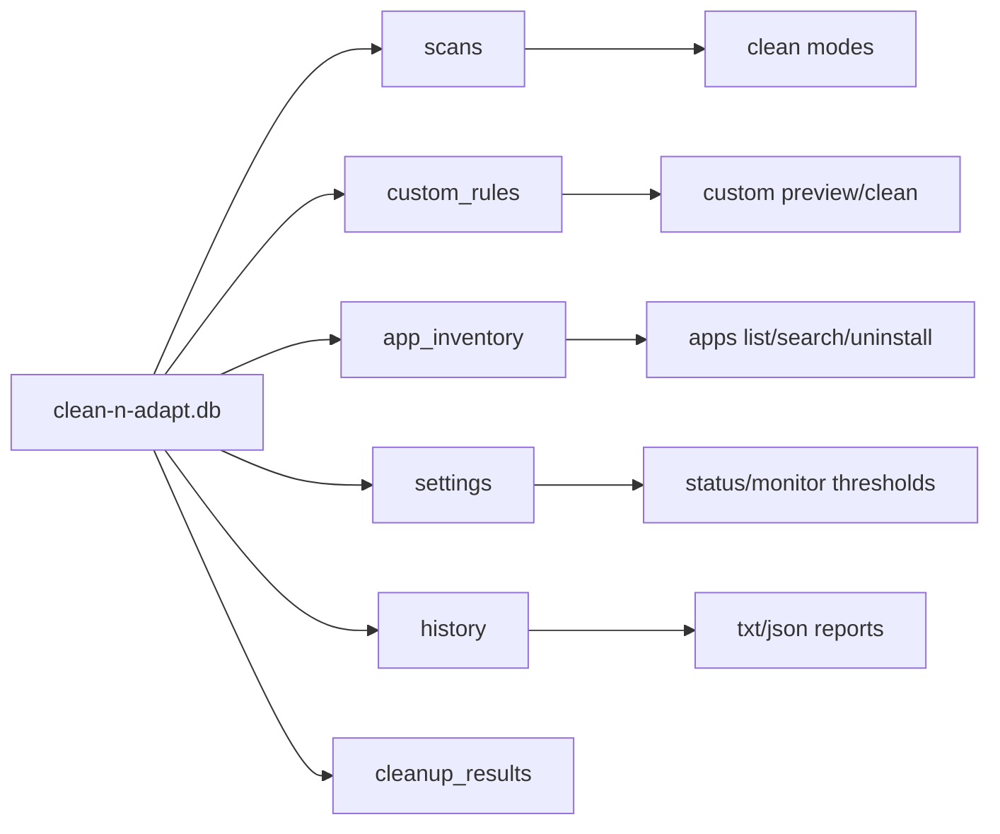
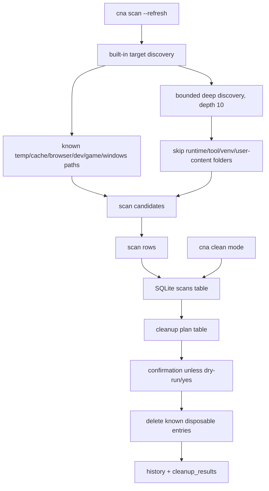
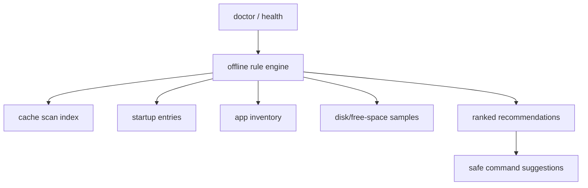
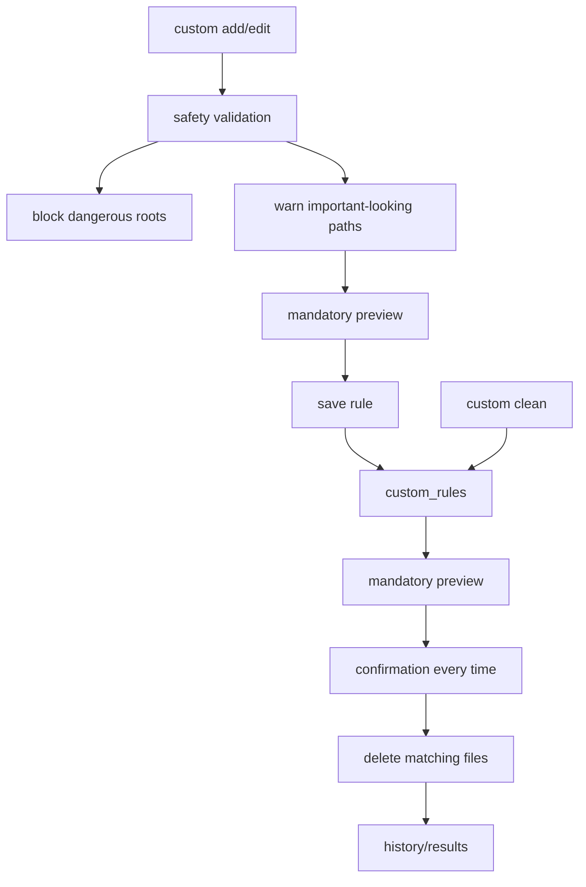
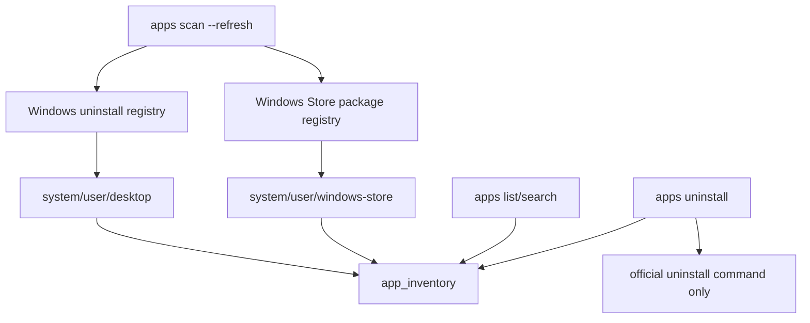
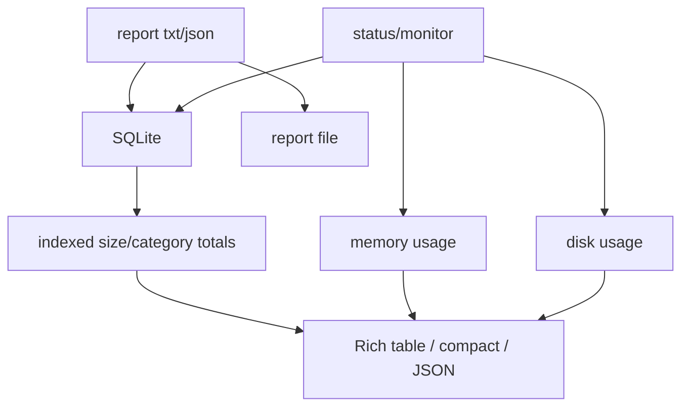

# clean-n-adapt Architecture

clean-n-adapt is a Windows-first Python CLI. The CLI and the Rich menu UI call the same command functions, so scripted usage and interactive usage stay linked.

## Runtime Principles

- Keep CLI and TUI behavior connected through the same command functions.
- Keep installer/native Windows integration separate from the cleanup engine.
- Store runtime state beside the executable by default.
- Cache expensive scans in SQLite and refresh only when requested.
- Prefer previews and official uninstall commands over blind deletion.
- Keep deep discovery bounded and skip runtime/tool/virtual environment folders.

## High-level flow

## Layered target shape

## Install and runtime layout

## Source layout

The repository uses a hyphenated project name and an underscored Python package name because Python modules cannot be imported with hyphens.

## SQLite state

## Cache scan and clean

## Diagnostics and recommendations

The doctor command does not call an online service or LLM. It uses local thresholds and cached inventory to explain what the user can do next.

## Custom rules

## App inventory

## Monitor and reports

