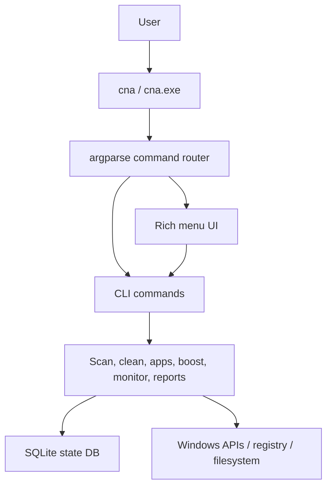
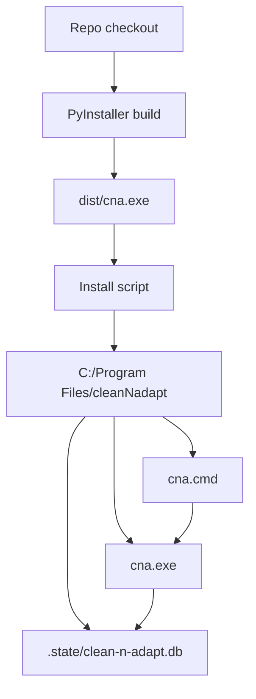
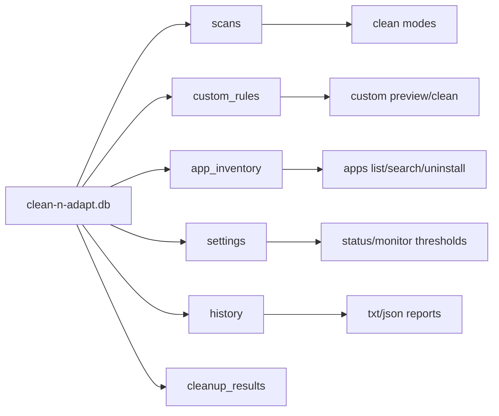
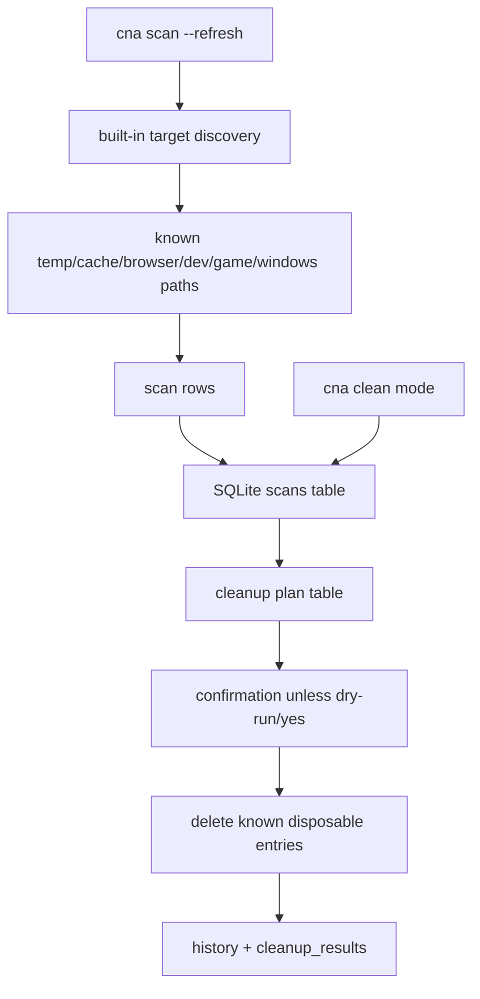
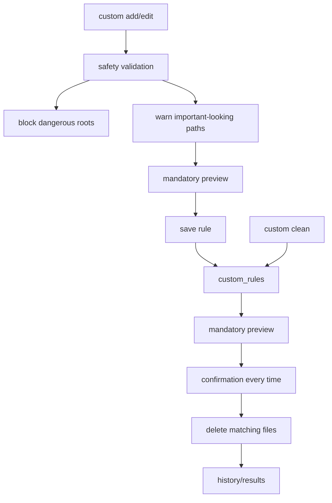
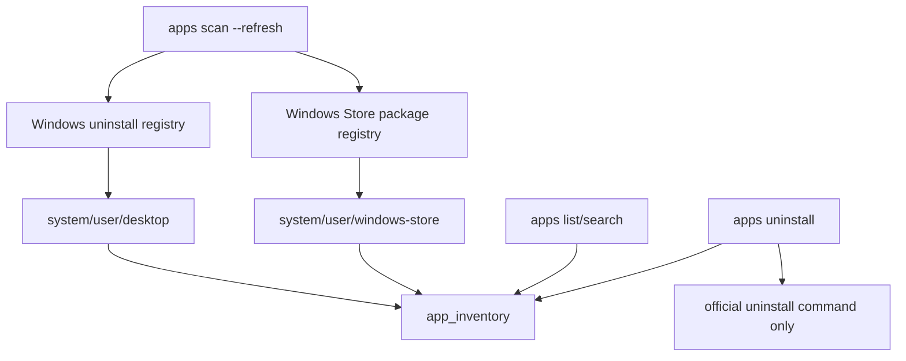
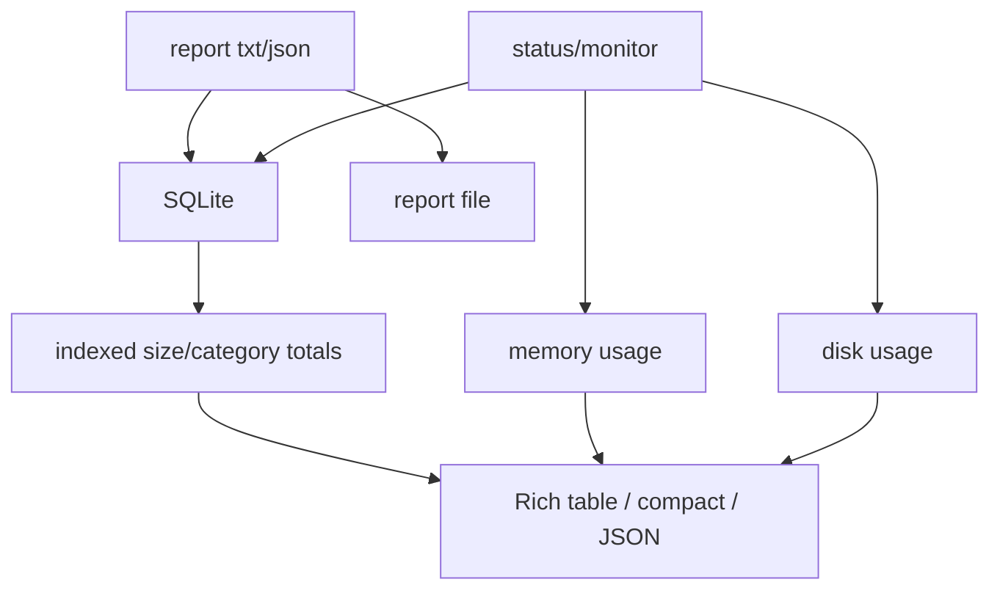

# Architecture

clean-n-adapt is a Windows-first Python CLI. The CLI and the Rich menu UI call the same command functions, so scripted usage and interactive usage stay linked.

## High-level flow

## Install and runtime layout

## SQLite state

## Cache scan and clean

## Custom rules

## App inventory

## Monitor and reports

