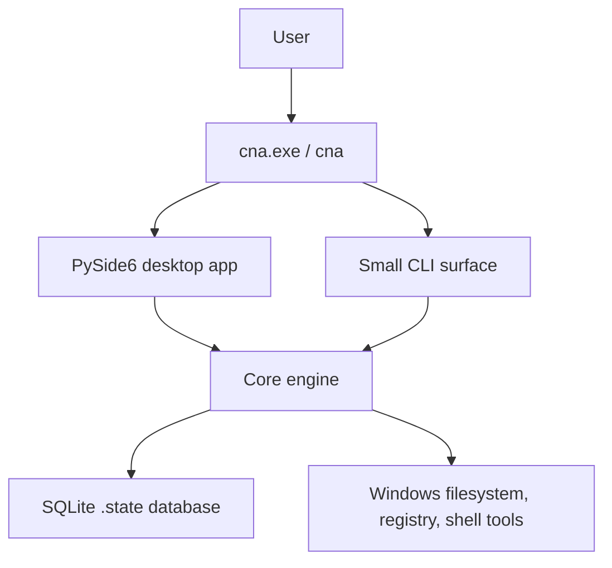
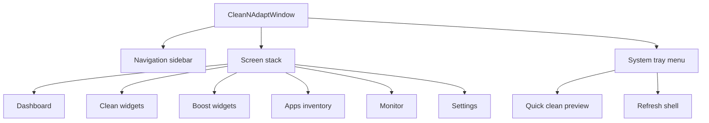
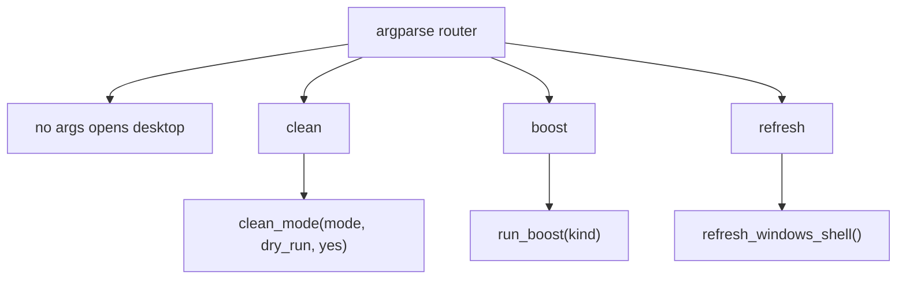
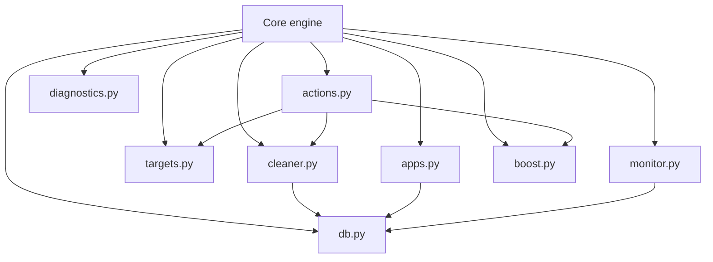
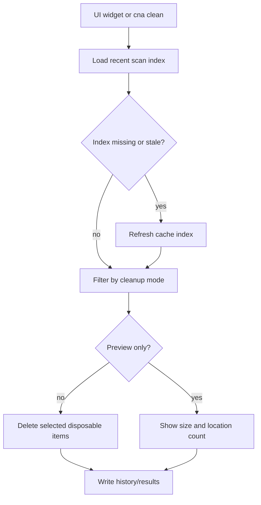
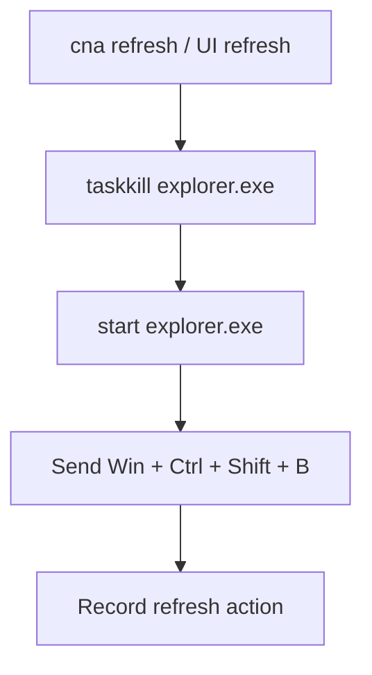
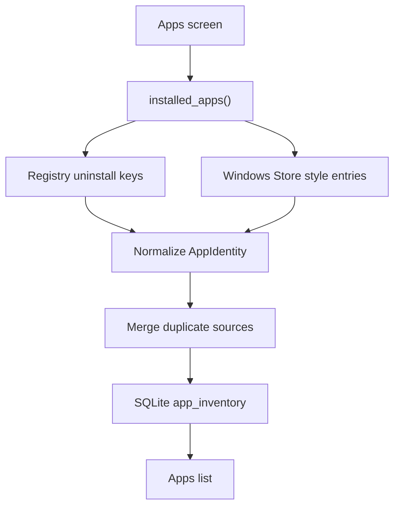
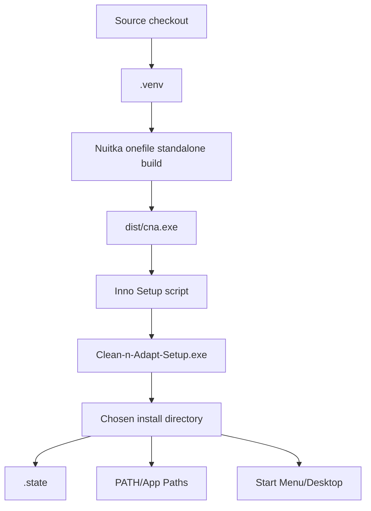
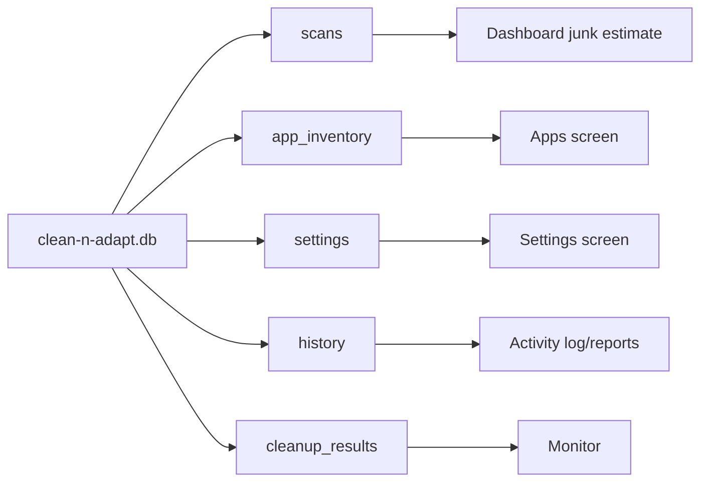
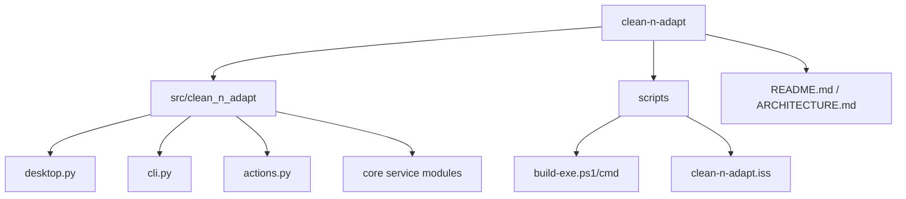

# clean-n-adapt Architecture

clean-n-adapt is moving from a CLI-first utility to a desktop-first Windows maintenance app. The CLI remains, but only for the small automation surface: `clean`, `boost`, and `refresh`.

## Principles

- The desktop UI is the main product.
- The CLI is intentionally small and scriptable.
- Cleanup, boost, app inventory, monitor, and settings live in reusable core modules.
- Scans are cached in SQLite and refreshed intentionally.
- Runtime state stays beside the installed executable in `.state`.
- Build output comes from Nuitka, not PyInstaller.
- Installer packaging is handled by Inno Setup.

## Product Flow

## UI Layer

## CLI Layer

## Core Engine

## Cleanup Flow

## Refresh Flow

## App Inventory

## Build and Installer

## State Database

## Package Layout

The repo keeps the public project name hyphenated, while the Python package uses `clean_n_adapt` because Python imports cannot use hyphens.
